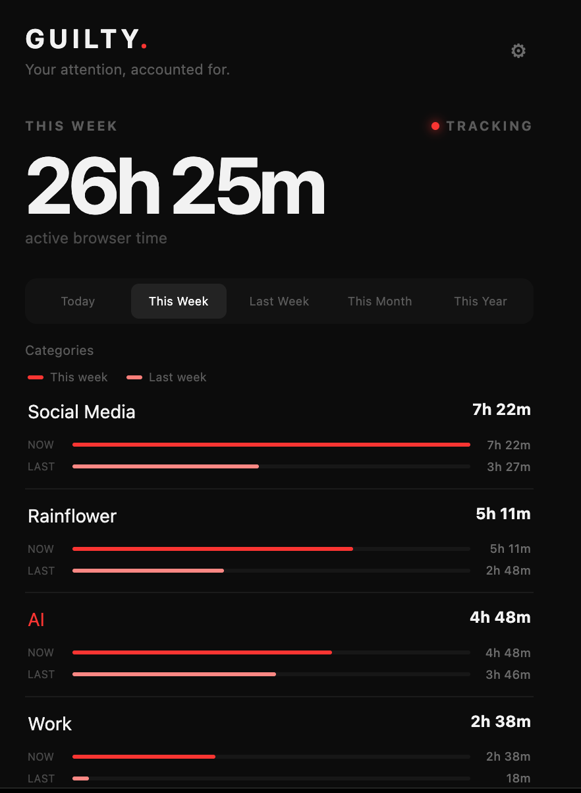

# GUILTY.

**Your attention, accounted for.**

A private, local-only Chrome extension that shows where your active browsing time goes.

[Download latest release](https://github.com/evoknow-ai/guilty/releases/latest) · [Install in Chrome](#install-in-chrome) · [Changelog](CHANGELOG.md)

## What Guilty does

Guilty measures **active browser time**, organizes it into categories you control, and makes the patterns easy to see. It ignores idle tabs, supports wildcard domain rules, compares this week with last week, and creates complete shareable PNG reports.

- Active-time tracking with a configurable idle timeout
- Today, This Week, Last Week, This Month, and This Year reports
- Editable categories and wildcard domain matching
- Inline assignment of uncategorized domains
- Current-week and previous-week comparison bars
- Per-category chart and comparison colors
- Folded category settings with individual and Open All/Fold All controls
- Full-report PNG sharing
- Settings backup and restore
- No account, server, analytics, or advertising

## Make it yours

Categories, domain rules, and chart colors are completely configurable. Exact domains and wildcards can coexist, and the most specific matching rule wins.

Examples:

| Rule | Matches |
| --- | --- |
| `google.com` | Google and its subdomains |
| `*google.com` | Google and its subdomains |
| `*.evoknow.io` | Evoknow and all of its subdomains |
| `docs.google.com` | Google Docs specifically |

This means a broad rule such as `*google.com` can coexist with a more specific rule such as `docs.google.com`.

## Install in Chrome

Guilty is not published in the Chrome Web Store. Install it locally:

1. Download the ZIP from the [latest release](https://github.com/evoknow-ai/guilty/releases/latest).
2. Unzip it to a permanent folder on your computer.
3. Open `chrome://extensions` in Chrome.
4. Enable **Developer mode**.
5. Click **Load unpacked** and select the unzipped Guilty folder.
6. Pin **Guilty** to the Chrome toolbar.

To update, replace the files in that same folder and click **Reload** on Guilty's `chrome://extensions` card. Tracking begins on pages opened or refreshed after installation.

## What counts as active

Time is counted only when a web page is the visible tab in the focused browser window and you have recently used the mouse, keyboard, wheel, scrolling, or touch. Leaving a tab open does not continuously inflate your time.

Sites with less than one minute of activity in the selected period are hidden from the site list to avoid clutter from redirects and accidental opens. Their raw seconds remain in local history and appear automatically after reaching one minute.

## Privacy by design

Guilty has no backend and makes no network transmission of your browsing history. All history, custom categories, wildcard rules, colors, and preferences remain in Chrome's local extension storage. Settings can be exported and restored from the Settings page.

The extension requests access to web pages so it can identify the active domain and receive local activity signals. It does not read or transmit page content.

## Project

- Read the [changelog](CHANGELOG.md)
- Review the [security policy](SECURITY.md)
- See how to [contribute](CONTRIBUTING.md)
- Report a [bug](https://github.com/evoknow-ai/guilty/issues/new?template=bug_report.yml) or suggest a [feature](https://github.com/evoknow-ai/guilty/issues/new?template=feature_request.yml)

**Imagined By: [Mohammed Kabir](https://x.com/mjkabir)** 
Developed by his agents. Visit [EatSleepAI](https://eatsleepai.us).

Guilty is available under the [MIT License](LICENSE).
